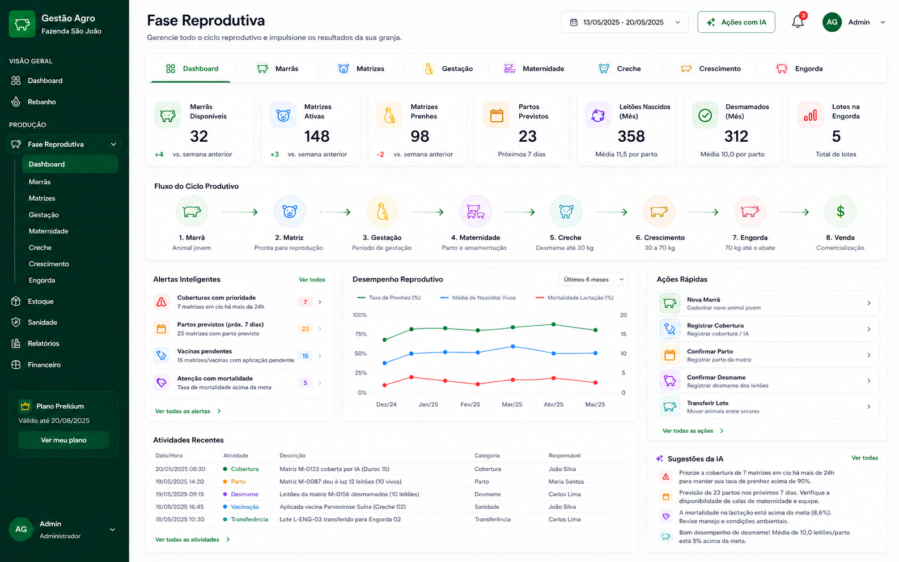
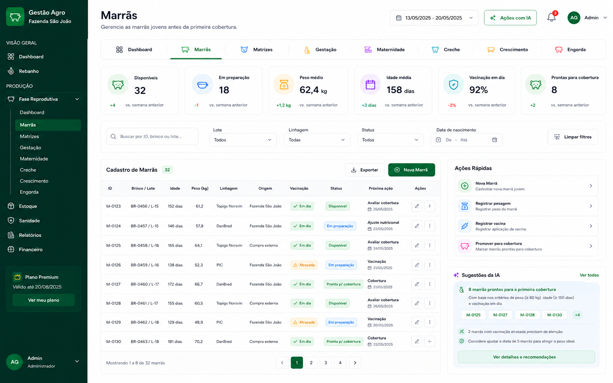
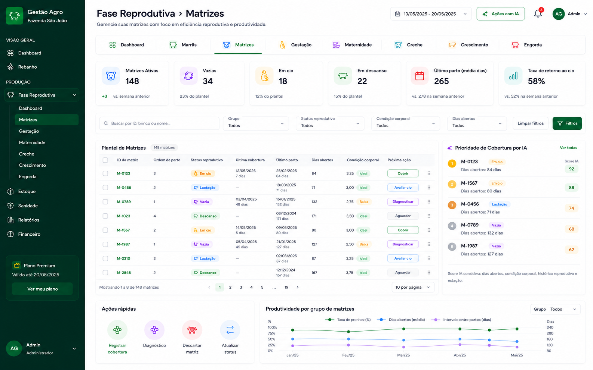
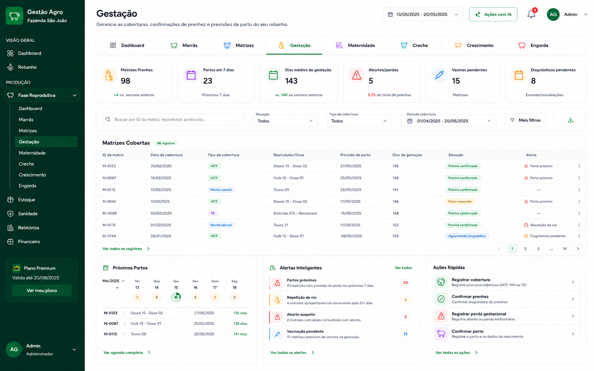
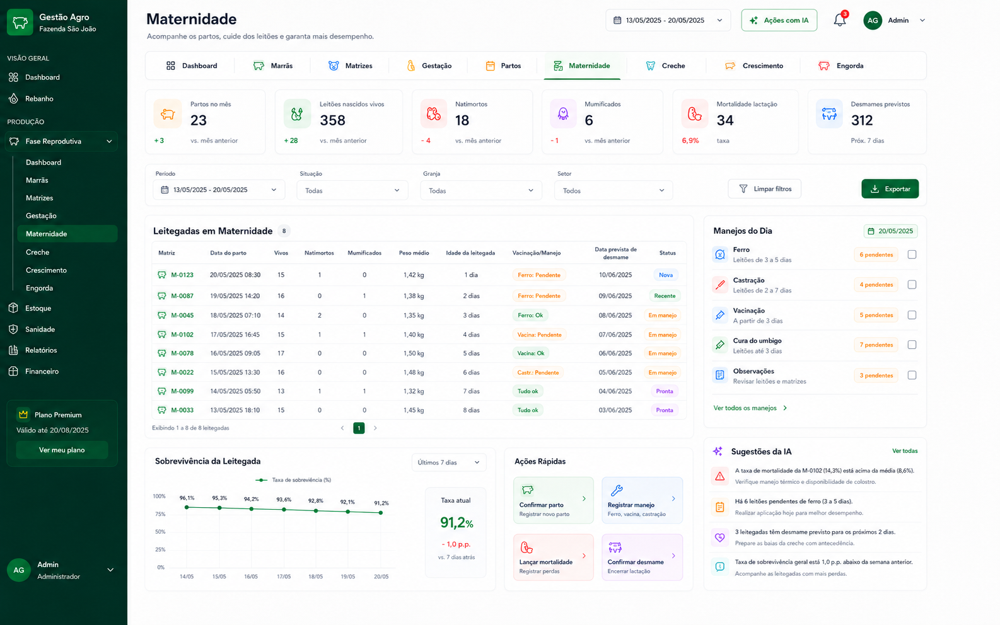
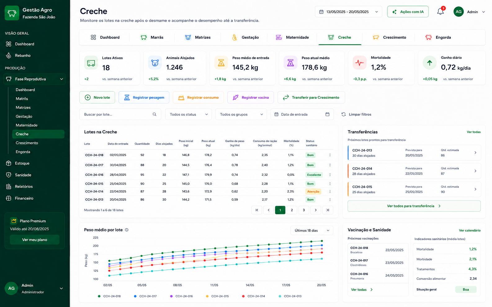
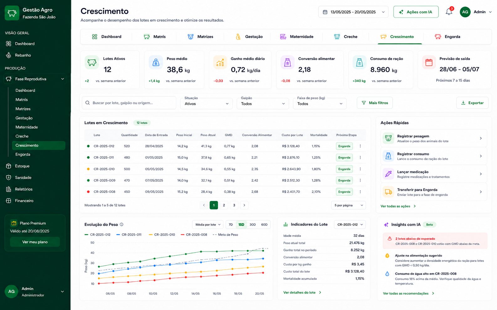
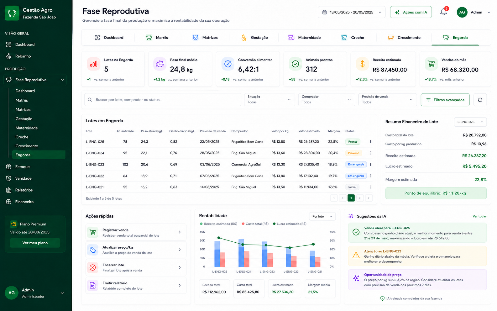

# Plano de Implementação — Módulo Fase Reprodutiva

## 1. Visão geral

Este plano descreve a implementação do módulo **Fase Reprodutiva** para um sistema de gestão agro voltado à criação de suínos.

A proposta é criar uma área centralizada para acompanhar o ciclo completo dos animais, desde a entrada como **marrã**, passando por **matriz**, **gestação**, **maternidade**, **creche**, **crescimento**, **engorda** e encerrando em **venda**.

A ideia principal é que o sistema seja simples para o usuário alimentar no dia a dia e, ao mesmo tempo, estruturado o suficiente para permitir manutenção, evolução e automações com IA.

Fluxo principal:

```text
Marrã → Matriz → Gestação → Maternidade → Creche → Crescimento → Engorda → Venda
```

A regra central do módulo é: **o usuário confirma eventos, e o sistema movimenta automaticamente os animais/lotes entre as fases**.

Exemplos:

- cadastrou uma fêmea jovem: entra como **Marrã**;
- registrou cobertura: vai para **Gestação**;
- confirmou parto: cria leitegada e vai para **Maternidade**;
- confirmou desmame: cria lote e vai para **Creche**;
- transferiu lote: vai para **Crescimento**;
- transferiu novamente: vai para **Engorda**;
- registrou venda: encerra o lote.

---

## 2. Objetivos do módulo

### Objetivo principal

Controlar todo o ciclo produtivo/reprodutivo de suínos com rastreabilidade, indicadores e automação de movimentação entre fases.

### Objetivos específicos

- Evitar lançamento duplicado de informações.
- Reduzir movimentações manuais entre abas.
- Criar histórico completo da matriz, leitegada e lote.
- Facilitar decisões de manejo com alertas e sugestões.
- Exibir indicadores produtivos e financeiros.
- Preparar a estrutura para relatórios e IA no futuro.
- Manter o sistema simples para pequenos e médios produtores.

---

## 3. Estrutura visual recomendada

A navegação deve evitar um menu lateral poluído. O ideal é manter um único item principal no menu lateral chamado **Fase Reprodutiva**.

Dentro da tela, usar abas superiores:

```text
Dashboard | Marrãs | Matrizes | Gestação | Maternidade | Creche | Crescimento | Engorda
```

### Menu lateral recomendado

```text
Dashboard
Rebanho
Fase Reprodutiva
Estoque
Sanidade
Relatórios
Financeiro
Configurações
```

### Padrão visual

- Sidebar verde escura.
- Fundo principal claro.
- Cards brancos com bordas arredondadas.
- Ícones por fase.
- KPIs no topo de cada aba.
- Barra de filtros sempre antes da tabela.
- Tabelas com badges de status.
- Botões de ação rápida.
- Painel de alertas e sugestões com IA.
- Layout responsivo para desktop e tablet.

---

## 4. Imagens de referência do módulo

As imagens estão na pasta `imagens/` dentro deste ZIP.

| Tela | Arquivo |
|---|---|
| Dashboard geral | `imagens/01-dashboard-fase-reprodutiva.png` |
| Aba Marrãs | `imagens/02-aba-marras.png` |
| Aba Matrizes | `imagens/03-aba-matrizes.png` |
| Aba Gestação | `imagens/04-aba-gestacao.png` |
| Aba Maternidade | `imagens/05-aba-maternidade.png` |
| Aba Creche | `imagens/06-aba-creche.png` |
| Aba Crescimento | `imagens/07-aba-crescimento.png` |
| Aba Engorda/Venda | `imagens/08-aba-engorda-venda.png` |

### Prévia das telas

















---

## 5. Entidades principais do sistema

### 5.1 Animal

Representa a fêmea individual antes e durante a vida reprodutiva.

Campos sugeridos:

- `id`
- `identificacao`
- `brinco`
- `lote_origem`
- `data_nascimento`
- `data_entrada`
- `sexo`
- `linhagem`
- `origem`
- `peso_inicial`
- `peso_atual`
- `status_atual`
- `status_sanitario`
- `observacoes`
- `created_at`
- `updated_at`

### 5.2 Matriz

Pode ser uma extensão de `Animal` ou um registro vinculado ao animal quando a marrã entra no ciclo reprodutivo.

Campos sugeridos:

- `animal_id`
- `ordem_parto`
- `status_reprodutivo`
- `ultima_cobertura`
- `ultimo_parto`
- `dias_abertos`
- `condicao_corporal`
- `ativa`
- `motivo_descarte`

### 5.3 Cobertura

Representa inseminação artificial, monta natural ou transferência de embrião.

Campos sugeridos:

- `matriz_id`
- `data_cobertura`
- `tipo_cobertura`
- `reprodutor`
- `dose_semen`
- `tecnico_responsavel`
- `previsao_parto`
- `status`
- `observacoes`

### 5.4 Gestação

Pode ser derivada da cobertura confirmada ou uma entidade própria para facilitar consultas.

Campos sugeridos:

- `matriz_id`
- `cobertura_id`
- `data_inicio`
- `previsao_parto`
- `data_confirmacao_prenhez`
- `status_gestacao`
- `dias_gestacao`
- `alerta_parto_proximo`

### 5.5 Parto

Registro do parto da matriz.

Campos sugeridos:

- `matriz_id`
- `gestacao_id`
- `data_parto`
- `leitões_vivos`
- `natimortos`
- `mumificados`
- `total_nascidos`
- `peso_medio_leitegada`
- `problemas_ocorridos`
- `medicamentos_aplicados`
- `observacoes`

### 5.6 Leitegada

Grupo de leitões vinculado à matriz após o parto.

Campos sugeridos:

- `parto_id`
- `matriz_id`
- `quantidade_inicial`
- `quantidade_atual`
- `data_nascimento`
- `peso_medio_nascimento`
- `peso_medio_atual`
- `mortalidade`
- `data_prevista_desmame`
- `status`

### 5.7 Desmame

Evento de encerramento da maternidade e criação do lote na creche.

Campos sugeridos:

- `leitegada_id`
- `data_desmame`
- `quantidade_desmamada`
- `peso_medio_desmame`
- `mortalidade_maternidade`
- `destino`
- `observacoes`

### 5.8 Lote

Representa o grupo de animais nas fases de creche, crescimento e engorda.

Campos sugeridos:

- `codigo_lote`
- `fase_atual`
- `origem`
- `data_entrada_fase`
- `quantidade_inicial`
- `quantidade_atual`
- `peso_inicial`
- `peso_atual`
- `status`
- `galpao`
- `baia`
- `observacoes`

### 5.9 Movimentação de Lote

Histórico das transferências entre fases.

Campos sugeridos:

- `lote_id`
- `fase_origem`
- `fase_destino`
- `data_movimentacao`
- `quantidade_transferida`
- `peso_medio`
- `perdas`
- `responsavel`
- `observacoes`

### 5.10 Venda

Encerramento comercial do lote.

Campos sugeridos:

- `lote_id`
- `data_venda`
- `quantidade_vendida`
- `peso_final_medio`
- `comprador`
- `valor_por_kg`
- `valor_total`
- `custo_total_lote`
- `lucro_estimado`
- `observacoes`

---

## 6. Dashboard geral da Fase Reprodutiva

### Objetivo

Consolidar a visão operacional do ciclo inteiro em uma única tela.

### Componentes

- Cards de indicadores.
- Fluxo visual do ciclo produtivo.
- Alertas inteligentes.
- Ações rápidas.
- Atividades recentes.
- Gráfico de desempenho reprodutivo.
- Sugestões de IA.

### Indicadores sugeridos

- Marrãs disponíveis.
- Matrizes ativas.
- Matrizes prenhes.
- Partos previstos.
- Leitões nascidos no mês.
- Leitões desmamados no mês.
- Lotes na creche.
- Lotes em crescimento.
- Lotes na engorda.
- Mortalidade.
- Taxa de prenhez.
- Conversão alimentar.
- Receita estimada.

### Regras

- Cards devem ser clicáveis.
- Alertas devem abrir a tela filtrada.
- Ações rápidas devem abrir formulários em modal ou drawer lateral.
- O dashboard deve carregar dados agregados, sem obrigar o usuário a abrir cada aba.

---

## 7. Fase 1 — Aba Marrãs

### Objetivo

Controlar fêmeas jovens antes da primeira cobertura.

### Entrada no fluxo

Toda nova fêmea cadastrada entra inicialmente como **Marrã**.

### Campos do cadastro

- Identificação.
- Brinco.
- Lote.
- Data de nascimento.
- Data de entrada.
- Linhagem/genética.
- Peso inicial.
- Peso atual.
- Origem/fornecedor.
- Vacinação.
- Status sanitário.
- Observações.

### Status

- Disponível.
- Em preparação.
- Pronta para cobertura.
- Coberta.
- Descartada.

### Ações da tela

- Nova Marrã.
- Registrar pesagem.
- Registrar vacina.
- Atualizar status.
- Promover para cobertura.
- Descartar marrã.

### Automação

Quando o usuário registrar cobertura:

1. criar registro de cobertura;
2. calcular previsão de parto com 114 dias;
3. alterar status da marrã para `Coberta`;
4. promover animal para matriz, se ainda não existir registro;
5. mover automaticamente para Gestação/Matrizes Cobertas;
6. registrar evento no histórico.

### Sugestões com IA

A IA pode indicar marrãs aptas para cobertura com base em:

- idade mínima configurada;
- peso mínimo configurado;
- vacinação em dia;
- condição corporal;
- histórico sanitário;
- tempo de preparação.

---

## 8. Fase 2 — Aba Matrizes

### Objetivo

Gerenciar o plantel de matrizes e controlar o status reprodutivo.

### Campos principais

- ID da matriz.
- Brinco.
- Ordem de parto.
- Status reprodutivo.
- Última cobertura.
- Último parto.
- Dias abertos.
- Condição corporal.
- Histórico de partos.
- Histórico sanitário.
- Observações.

### Status

- Vazia.
- Em cio.
- Coberta.
- Prenhe.
- Lactante.
- Descanso.
- Descartada.

### Ações da tela

- Registrar cobertura.
- Diagnóstico de prenhez.
- Atualizar status.
- Ver histórico.
- Descartar matriz.

### Automação

- Ao confirmar cobertura, a matriz vai para Gestação.
- Ao confirmar parto, vai para Maternidade.
- Ao confirmar desmame, volta para Matriz/Descanso ou fila de cobertura.
- Ao descartar, sai do fluxo produtivo ativo.

### Sugestões com IA

- Priorizar matrizes em cio.
- Identificar matrizes com muitos dias abertos.
- Sugerir descarte por baixa produtividade.
- Sugerir cobertura por histórico de desempenho.

---

## 9. Fase 3 — Aba Gestação

### Objetivo

Acompanhar matrizes cobertas/prenhes, previsão de parto, confirmação de prenhez e alertas sanitários.

### Campos principais

- Matriz.
- Data da cobertura.
- Tipo de cobertura.
- Reprodutor/dose.
- Técnico responsável.
- Previsão de parto.
- Dias de gestação.
- Diagnóstico de prenhez.
- Situação atual.
- Medicamentos/vacinas.
- Observações.

### Status

- Aguardando diagnóstico.
- Prenha confirmada.
- Parto próximo.
- Repetição de cio.
- Aborto/perda.
- Encerrada.

### Ações da tela

- Registrar cobertura.
- Confirmar prenhez.
- Registrar perda gestacional.
- Confirmar parto.
- Registrar vacina.
- Ver histórico da matriz.

### Automação

Ao salvar cobertura:

```text
previsao_parto = data_cobertura + 114 dias
```

Ao confirmar parto:

1. criar registro de parto;
2. criar leitegada;
3. alterar matriz para Lactante;
4. mover matriz para Maternidade;
5. encerrar gestação;
6. gerar previsão de desmame.

### Alertas

- Parto previsto nos próximos 7 dias.
- Diagnóstico pendente.
- Repetição de cio.
- Vacina pendente.
- Gestação acima do prazo.
- Aborto/perda registrada.

---

## 10. Fase 4 — Aba Maternidade

### Objetivo

Controlar parto, leitegada, manejos iniciais, mortalidade e desmame.

### Campos do parto

- Data do parto.
- Matriz.
- Leitões nascidos vivos.
- Natimortos.
- Mumificados.
- Total de nascidos.
- Peso médio da leitegada.
- Problemas ocorridos.
- Medicamentos aplicados.
- Observações.

### Campos da leitegada

- Quantidade inicial.
- Quantidade atual.
- Idade dos leitões.
- Peso médio.
- Mortalidade.
- Vacinação.
- Aplicação de ferro.
- Castração.
- Manejos realizados.
- Data prevista de desmame.

### Ações da tela

- Confirmar parto.
- Registrar manejo.
- Registrar mortalidade.
- Registrar pesagem.
- Confirmar desmame.

### Automação

Ao confirmar desmame:

1. registrar evento de desmame;
2. encerrar fase de maternidade da leitegada;
3. criar lote na Creche;
4. transferir quantidade desmamada para o novo lote;
5. alterar matriz para Descanso ou Fila de Cobertura;
6. atualizar indicadores de produtividade da matriz.

### Alertas

- Aplicação de ferro pendente.
- Castração pendente.
- Vacinação pendente.
- Mortalidade acima da meta.
- Desmame previsto.
- Leitegada com baixo peso médio.

---

## 11. Fase 5 — Aba Creche

### Objetivo

Monitorar lotes recém-desmamados até a transferência para crescimento.

### Campos principais

- Código do lote.
- Data de entrada.
- Origem/leitegada.
- Quantidade inicial.
- Quantidade atual.
- Dias alojados.
- Peso inicial.
- Peso atual.
- Ganho de peso.
- Consumo de ração.
- Vacinação.
- Mortalidade.
- Status sanitário.

### Ações da tela

- Novo lote.
- Registrar pesagem.
- Registrar consumo de ração.
- Registrar vacina.
- Registrar mortalidade.
- Transferir para Crescimento.

### Automação

Ao transferir para Crescimento:

1. registrar saída da Creche;
2. validar quantidade transferida;
3. registrar perdas, se houver;
4. criar movimentação de lote;
5. alterar `fase_atual` para Crescimento;
6. manter histórico completo.

### Alertas

- Lote pronto para transferência.
- Vacinação pendente.
- Mortalidade acima da meta.
- Peso abaixo do esperado.
- Consumo de ração fora do padrão.

---

## 12. Fase 6 — Aba Crescimento

### Objetivo

Acompanhar ganho de peso, conversão alimentar, custos e transferência para engorda.

### Campos principais

- Lote.
- Quantidade.
- Data de entrada.
- Peso inicial.
- Peso atual.
- Ganho médio diário.
- Conversão alimentar.
- Consumo de ração.
- Custo por lote.
- Mortalidade.
- Previsão de saída.

### Ações da tela

- Registrar pesagem.
- Registrar consumo.
- Lançar medicação.
- Registrar mortalidade.
- Transferir para Engorda.

### Automação

Ao transferir para Engorda:

1. validar quantidade atual;
2. registrar peso médio de saída;
3. registrar perdas;
4. atualizar histórico do lote;
5. alterar fase para Engorda.

### Sugestões com IA

- Identificar lotes abaixo da curva de peso.
- Sugerir ajuste alimentar.
- Detectar aumento de mortalidade.
- Apontar consumo fora do padrão.

---

## 13. Fase 7 — Aba Engorda/Venda

### Objetivo

Controlar a fase final da produção, previsão de venda, receita, margem e encerramento do lote.

### Campos principais

- Lote.
- Quantidade.
- Peso atual.
- Peso final médio.
- Ganho diário.
- Conversão alimentar.
- Previsão de venda.
- Comprador.
- Valor por kg.
- Valor estimado.
- Custo total do lote.
- Lucro estimado.
- Status.

### Ações da tela

- Registrar venda.
- Atualizar preço por kg.
- Encerrar lote.
- Emitir relatório.
- Ver resumo financeiro.

### Automação

Ao registrar venda:

1. registrar data da venda;
2. registrar quantidade vendida;
3. calcular valor total;
4. calcular lucro estimado;
5. encerrar lote ou reduzir quantidade atual, se venda parcial;
6. atualizar relatórios financeiros;
7. registrar histórico comercial.

### Sugestões com IA

- Melhor momento de venda.
- Lote pronto para venda.
- Preço/kg abaixo ou acima da média.
- Lote com margem reduzida.
- Alerta de custo elevado.

---

## 14. Regras de negócio essenciais

### 14.1 Previsão de parto

```text
previsao_parto = data_cobertura + 114 dias
```

### 14.2 Criação automática de leitegada

Quando o parto for confirmado, o sistema deve criar uma leitegada vinculada à matriz.

```text
quantidade_inicial = vivos + natimortos + mumificados
quantidade_atual = vivos
```

### 14.3 Criação automática de lote na creche

Quando o desmame for confirmado, o sistema deve criar um lote na fase Creche.

```text
quantidade_lote = quantidade_desmamada
peso_inicial_lote = peso_medio_desmame
fase_atual = Creche
```

### 14.4 Histórico obrigatório

Toda ação importante deve gerar histórico:

- cadastro;
- cobertura;
- diagnóstico;
- parto;
- manejo;
- mortalidade;
- desmame;
- transferência;
- venda;
- descarte.

### 14.5 Venda parcial

O sistema deve permitir venda parcial do lote.

Se a quantidade vendida for menor que a quantidade atual:

```text
quantidade_atual = quantidade_atual - quantidade_vendida
status = Em engorda
```

Se a quantidade vendida for igual à quantidade atual:

```text
quantidade_atual = 0
status = Encerrado
```

---

## 15. Componentes reutilizáveis no frontend

Para facilitar manutenção, criar componentes genéricos.

### Componentes visuais

- `PageHeader`
- `PhaseTabs`
- `KpiCard`
- `StatusBadge`
- `FilterBar`
- `DataTable`
- `QuickActionsCard`
- `AiSuggestionsCard`
- `AlertListCard`
- `HistoryTimeline`
- `FormDrawer`
- `ConfirmDialog`
- `MetricChart`

### Componentes por fase

- `MarrasTable`
- `MatrizesTable`
- `GestacaoTable`
- `MaternidadeTable`
- `CrecheTable`
- `CrescimentoTable`
- `EngordaTable`

### Formulários

- `MarraForm`
- `CoberturaForm`
- `PrenhezForm`
- `PartoForm`
- `ManejoForm`
- `DesmameForm`
- `TransferenciaLoteForm`
- `VendaForm`

---

## 16. Estrutura sugerida de rotas

Exemplo para Next.js:

```text
/app/home/fase-reprodutiva/page.tsx
/app/home/fase-reprodutiva/marras/page.tsx
/app/home/fase-reprodutiva/matrizes/page.tsx
/app/home/fase-reprodutiva/gestacao/page.tsx
/app/home/fase-reprodutiva/maternidade/page.tsx
/app/home/fase-reprodutiva/creche/page.tsx
/app/home/fase-reprodutiva/crescimento/page.tsx
/app/home/fase-reprodutiva/engorda/page.tsx
```

Ou usar uma única rota com query param:

```text
/home/fase-reprodutiva?tab=marras
/home/fase-reprodutiva?tab=matrizes
/home/fase-reprodutiva?tab=gestacao
```

Para manutenção, a abordagem com **uma rota e abas controladas por query param** pode ser mais simples no início.

---

## 17. Estrutura sugerida de API

Exemplo de endpoints REST:

```text
GET    /api/v1/reproductive/dashboard/
GET    /api/v1/reproductive/marras/
POST   /api/v1/reproductive/marras/
PATCH  /api/v1/reproductive/marras/{id}/
POST   /api/v1/reproductive/marras/{id}/coverage/

GET    /api/v1/reproductive/matrizes/
POST   /api/v1/reproductive/matrizes/{id}/coverage/
POST   /api/v1/reproductive/matrizes/{id}/pregnancy-diagnosis/
POST   /api/v1/reproductive/matrizes/{id}/discard/

GET    /api/v1/reproductive/gestations/
POST   /api/v1/reproductive/gestations/{id}/confirm-birth/
POST   /api/v1/reproductive/gestations/{id}/loss/

GET    /api/v1/reproductive/maternity/
POST   /api/v1/reproductive/litters/{id}/management/
POST   /api/v1/reproductive/litters/{id}/mortality/
POST   /api/v1/reproductive/litters/{id}/weaning/

GET    /api/v1/reproductive/lots/
POST   /api/v1/reproductive/lots/{id}/weight/
POST   /api/v1/reproductive/lots/{id}/feed-consumption/
POST   /api/v1/reproductive/lots/{id}/mortality/
POST   /api/v1/reproductive/lots/{id}/transfer/
POST   /api/v1/reproductive/lots/{id}/sale/
```

---

## 18. Arquitetura de implementação com IA

A IA deve entrar como apoio operacional, não como substituta da decisão do usuário.

### Onde usar IA

- Priorização de coberturas.
- Identificação de matrizes com risco de baixa produtividade.
- Detecção de leitegadas com mortalidade acima do padrão.
- Sugestão de lotes prontos para transferência.
- Detecção de lotes abaixo da curva de peso.
- Sugestão de melhor momento de venda.
- Geração de resumo diário da granja.

### Entrada de dados para IA

- Histórico da matriz.
- Ordem de parto.
- Dias abertos.
- Condição corporal.
- Taxa de prenhez.
- Dados de parto.
- Mortalidade.
- Peso médio.
- Consumo de ração.
- Conversão alimentar.
- Receita e custo do lote.

### Saída esperada

A IA deve retornar sugestões objetivas, por exemplo:

```text
Priorize a cobertura da matriz M-0123. Ela está em cio há mais de 24h, possui condição corporal ideal e bom histórico de parto.
```

```text
O lote CR-2025-008 está com ganho médio diário abaixo da meta. Verifique consumo de ração, temperatura e qualidade da água.
```

```text
O lote L-ENG-025 possui melhor janela de venda entre 21 e 23 de maio, considerando peso atual, ganho diário e preço/kg informado.
```

---

## 19. Plano de implementação por etapas

### Etapa 1 — Estrutura visual

Entregáveis:

- Layout base da tela Fase Reprodutiva.
- Sidebar ajustada.
- Abas superiores.
- Cards de KPI.
- Tabelas mockadas.
- Ações rápidas.
- Cards de IA mockados.

Objetivo: validar UX antes da regra de negócio completa.

### Etapa 2 — Banco de dados e models

Entregáveis:

- Models de Animal, Matriz, Cobertura, Gestação, Parto, Leitegada, Lote, Movimentação e Venda.
- Migrations.
- Admin Django.
- Seeds/massa inicial para teste.

Objetivo: consolidar estrutura de dados.

### Etapa 3 — Fluxo Marrã → Gestação

Entregáveis:

- Cadastro de marrã.
- Registro de cobertura.
- Cálculo automático de previsão de parto.
- Movimentação para Gestação.
- Histórico da matriz.

Objetivo: validar primeira transição automática.

### Etapa 4 — Fluxo Gestação → Maternidade

Entregáveis:

- Confirmação de prenhez.
- Confirmação de parto.
- Criação automática de leitegada.
- Alertas de parto próximo.
- Indicadores de nascimento.

Objetivo: validar nascimento e criação de leitegada.

### Etapa 5 — Fluxo Maternidade → Creche

Entregáveis:

- Registro de manejos.
- Registro de mortalidade.
- Confirmação de desmame.
- Criação automática de lote na creche.
- Retorno da matriz para descanso/fila de cobertura.

Objetivo: validar transição de leitegada para lote.

### Etapa 6 — Fluxo Creche → Crescimento → Engorda

Entregáveis:

- Pesagem por lote.
- Consumo de ração.
- Mortalidade por lote.
- Transferência entre fases.
- Indicadores de ganho de peso e conversão alimentar.

Objetivo: validar controle produtivo por lote.

### Etapa 7 — Engorda → Venda

Entregáveis:

- Registro de venda.
- Venda parcial ou total.
- Encerramento de lote.
- Cálculo de receita e lucro.
- Resumo financeiro do lote.

Objetivo: fechar o ciclo produtivo e financeiro.

### Etapa 8 — Dashboards, relatórios e IA

Entregáveis:

- Dashboard consolidado.
- Relatórios por matriz.
- Relatórios por lote.
- Relatórios financeiros.
- Alertas inteligentes.
- Sugestões com IA.

Objetivo: transformar dados operacionais em informação gerencial.

---

## 20. Critérios de aceite

O módulo deve ser considerado pronto quando:

- for possível cadastrar uma marrã;
- for possível registrar cobertura;
- o sistema calcular previsão de parto automaticamente;
- a matriz coberta aparecer na aba Gestação;
- for possível confirmar prenhez;
- for possível confirmar parto;
- o sistema criar leitegada automaticamente;
- for possível registrar manejos da maternidade;
- for possível confirmar desmame;
- o sistema criar lote na Creche automaticamente;
- for possível registrar pesagem e consumo dos lotes;
- for possível transferir lote para Crescimento;
- for possível transferir lote para Engorda;
- for possível registrar venda total ou parcial;
- o lote vendido ser encerrado corretamente;
- o dashboard consolidar os principais indicadores;
- os alertas automáticos aparecerem corretamente;
- os cards de IA exibirem recomendações úteis e não bloqueantes.

---

## 21. Prompt completo para geração com IA

Use este prompt como base em ferramentas como Lovable, Bolt, V0 ou similares.

```text
Crie uma seção completa chamada "Fase Reprodutiva" para um sistema web de gestão agropecuária voltado à suinocultura.

A interface deve seguir um estilo moderno, limpo, profissional e responsivo, com sidebar verde escura, cards brancos, ícones por etapa, abas superiores e layout de dashboard SaaS.

O módulo deve controlar o ciclo completo:
Marrã → Matriz → Gestação → Maternidade → Creche → Crescimento → Engorda → Venda.

A navegação deve possuir um item principal no menu lateral chamado "Fase Reprodutiva". Dentro da tela, deve haver abas superiores para: Dashboard, Marrãs, Matrizes, Gestação, Maternidade, Creche, Crescimento e Engorda.

Cada aba deve conter:
- cards de indicadores no topo;
- barra de filtros;
- tabela principal;
- ações rápidas;
- alertas quando necessário;
- sugestões da IA;
- badges de status;
- formulários objetivos para alimentação de dados.

O sistema deve movimentar automaticamente animais e lotes entre fases conforme o usuário confirma eventos:
- cadastro de marrã;
- cobertura;
- confirmação de prenhez;
- confirmação de parto;
- confirmação de desmame;
- transferência para creche;
- transferência para crescimento;
- transferência para engorda;
- venda.

Priorize facilidade de alimentação, manutenção simples, componentes reutilizáveis e experiência profissional para uso diário na granja.
```

---

## 22. Observações finais

A implementação deve começar simples. Não tente fazer todos os relatórios, IA e automações avançadas na primeira entrega.

A melhor ordem é:

1. validar interface;
2. criar banco e models;
3. implementar eventos principais;
4. validar movimentação automática;
5. criar dashboard;
6. adicionar alertas;
7. adicionar IA e relatórios.

O ponto mais importante é garantir a rastreabilidade. Cada animal, matriz, leitegada e lote precisa ter histórico claro do que aconteceu, quando aconteceu e quem registrou.
